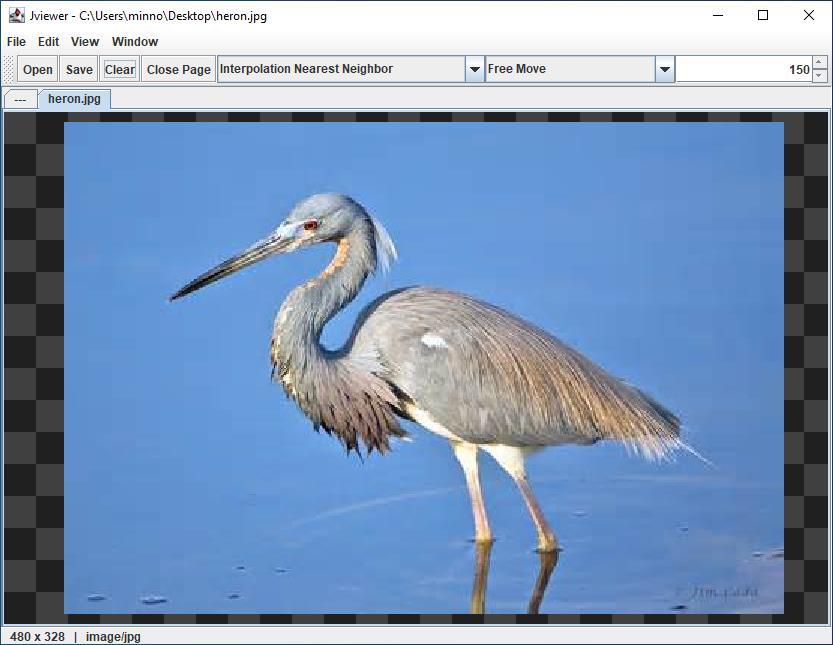
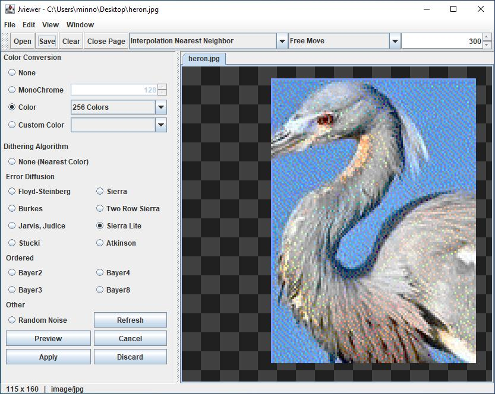

# JViewer

A cross platform image viewer.

<!-- TABLE OF CONTENTS -->

  
Table of Contents

  <ol>
    <li>
      <a href="#about-the-project">About The Project</a>
    </li>
    <li>
      <a href="#features">Features</a>
      <ul>
        <li><a href="#image-support">Image Support</a></li>
        <li><a href="#dithering-support">Dithering Support</a></li>
      </ul>
    </li>
    <li><a href="#screenshots">Screenshots</a></li>
    <li>
      <a href="#technical-information">Technical Information</a>
      <ul>
        <li><a href="#written-with">Written With</a></li>
        <li><a href="#imagemagick">ImageMagick</a></li>
      </ul>
    </li>
    <li><a href="#dependencies">Dependencies</a></li>
  </ol>

## About The Project

This project is a cross platform image viewer written in Java. For image formats not natively supported it can interface with [ImageMagick](https://github.com/ImageMagick/ImageMagick) to support almost every image format available! 

There are also several quick image processing options available such as Rotation, Inverting, Greyscale and Dithering. Simple things which are useful sometimes for quick and dirty processing.

 

## Features

As an image viewer, it is expected that it can view images.

JViewer uses a tab-style interface showing 1 image per tab, it has support for drag-and-drop and lets you copy/paste images into tabs.

### Image Support

By default JViewer can read any image supported by Java's [ImageIO](https://docs.oracle.com/javase/8/docs/api/javax/imageio/package-summary.html) API.

This API provides support for the following standard image formats:

| Format  | Reading | Writing | Notes              |
|---------|---------|---------|--------------------|
| JPEG    | yes     | yes     | none               |
| PNG     | yes     | yes     | none               |
| BMP     | yes     | yes     | none               |
| WBMP    | yes     | yes     | none               |
| GIF     | yes     | yes     | GIF plug-in notes  |

JViewer adds support for the following:

| Format  | Reading | Writing | Notes              |
|---------|---------|---------|--------------------|
| KRA     | yes     | No      | No Layers          |
| GIF     | yes     | yes     | none               |

When using ImageMagick the following formats have been tested:

| Format  | Reading | Writing | Notes              |
|---------|---------|---------|--------------------|
| JXL     | yes     | yes     | No Animation       |
| AVIF    | yes     | yes     | None               |
| WEBP    | yes     | yes     | No Animation       |
| PSD     | yes     | yes     | No Layer Support   |
| QOI     | yes     | yes     | None               |
| JP2     | yes     | yes     | None               |
| SVG     | yes     | No      | Unknown            |

### Dithering Support 

JViewer has native support both [Error-Diffusion](https://en.wikipedia.org/wiki/Error_diffusion) and [Ordered](https://en.wikipedia.org/wiki/Ordered_dithering) dithering algorithms:

  
Supported Error-Diffusion-Dithering

- Floyd-Steinberg
- Sierra
- Burkes
- Two Row Sierra
- Jarvis, Judice
- Sierra Lite
- Stucki
- Atkinson
- Random Noise

  
Supported Ordered-Dithering

- Bayer2
- Bayer3
- Bayer4
- Bayer8

 

## Screenshots 

  
Main Window

  
Dither Panel

 

## Technical Information

### Written With

JViewer is Java 8 compatible and makes use of [Maven](https://maven.apache.org/) for all dependencies and builds.

### ImageMagick

For loading and saving images using ImageMagick JViewer uses [Im4Java](https://github.com/penpot/im4java).

This wrapper allows JViewer to use any existing ImageMagick installation already on your system.

If you don't have or don't want to use ImageMagick, JViewer will read most common image formats.

### Dependencies

- [im4java](https://mvnrepository.com/artifact/org.im4java/im4java)

- [Tinylog2](https://tinylog.org/v2/)
